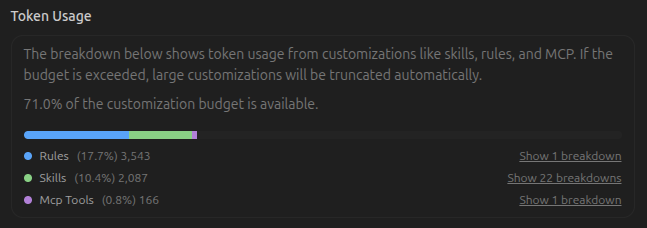

# Greybeard & Antigravity Setup

**Greybeard** is a definitive, battle-tested set of core behavioral rules designed to elevate any AI coding assistant into a pragmatic, senior-level autonomous engineering agent.

In my setup, I use **Google Antigravity (AGY)** as my primary AI coding assistant. This repository shares my personal setup, containing both the core rules and the specialized skills I rely on daily to maintain discipline and efficiency in my workflow. 

Rather than focusing solely on syntax, Greybeard defines the **"how"**—the decision priorities, problem-solving methodologies, and strict behavioral guardrails that prevent common AI pitfalls like over-engineering, hallucination, and unnecessary code churn.

## 🌟 Why Greybeard + Antigravity?

Most AI coding assistants fail not because they lack knowledge, but because they lack discipline. Greybeard fixes this by acting as a strict behavioral framework that prioritizes user intent, verification, and simplicity. When paired with the power of Antigravity, the agent becomes incredibly autonomous, smart, and precise.

## 📖 Rules vs. Skills: What's the Difference?

To use this setup effectively, it's crucial to understand the distinction between **Rules** and **Skills**:

*   **Rules (The "How"):** Absolute behavioral constraints and guiding principles. They dictate *how* the AI should think, prioritize, and communicate.
    *   *Location:* You can find the Ultimate Rules in the `rule/` directory.
*   **Skills (The "What"):** Task-specific, contextual instructions. They dictate *what* steps the AI should take to accomplish a specific technical goal.
    *   *Location:* Available in the `skills/` directory.

## 🚀 How to Use (Cara Pakai)

To get the most out of your AI agent (like Antigravity), you **must** set up both the rules and the skills. 

1. **Install All Skills**: Copy the entire `skills/` directory into your agent's configuration folder (for Antigravity, this is usually `~/.gemini/config/skills/` or your workspace `.agents/skills/`).
2. **Implement the Rules (Wajib!)**: You **must** apply the rules from `rule/RULES.md` into your agent's system prompt or global instruction file (e.g., `AGENTS.md` for Antigravity). 
   
> **Important:** If you only install the skills without implementing the rules, the agent won't have the discipline to properly use those skills. The rules force the agent to actually execute and utilize the skills you have installed!

### Other Agents (Cursor, Windsurf, etc.)
- **Cursor**: Create a `.cursorrules` file and copy the contents of `rule/RULES.md`.
- **Windsurf**: Create a `.windsurfrules` file and copy the contents of `rule/RULES.md`.

## 📄 License

This project is licensed under the MIT License - see the [LICENSE](./LICENSE) file for details.